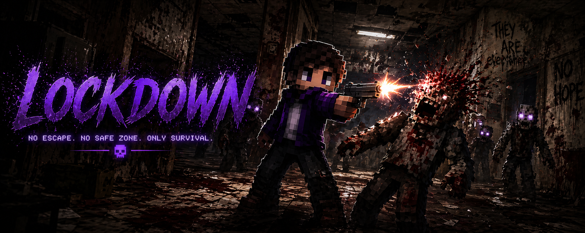
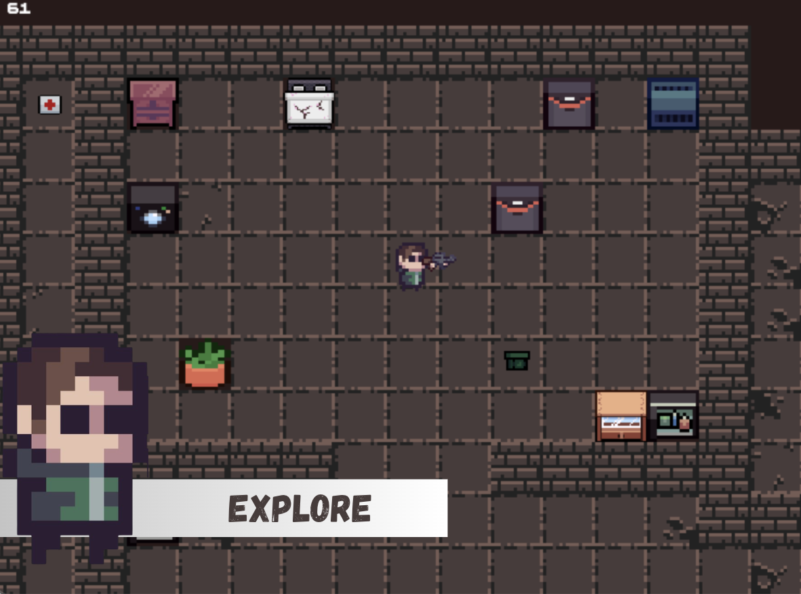
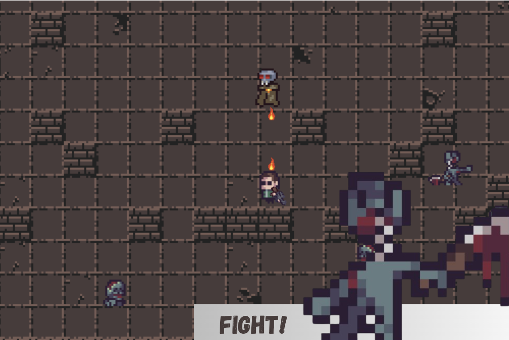
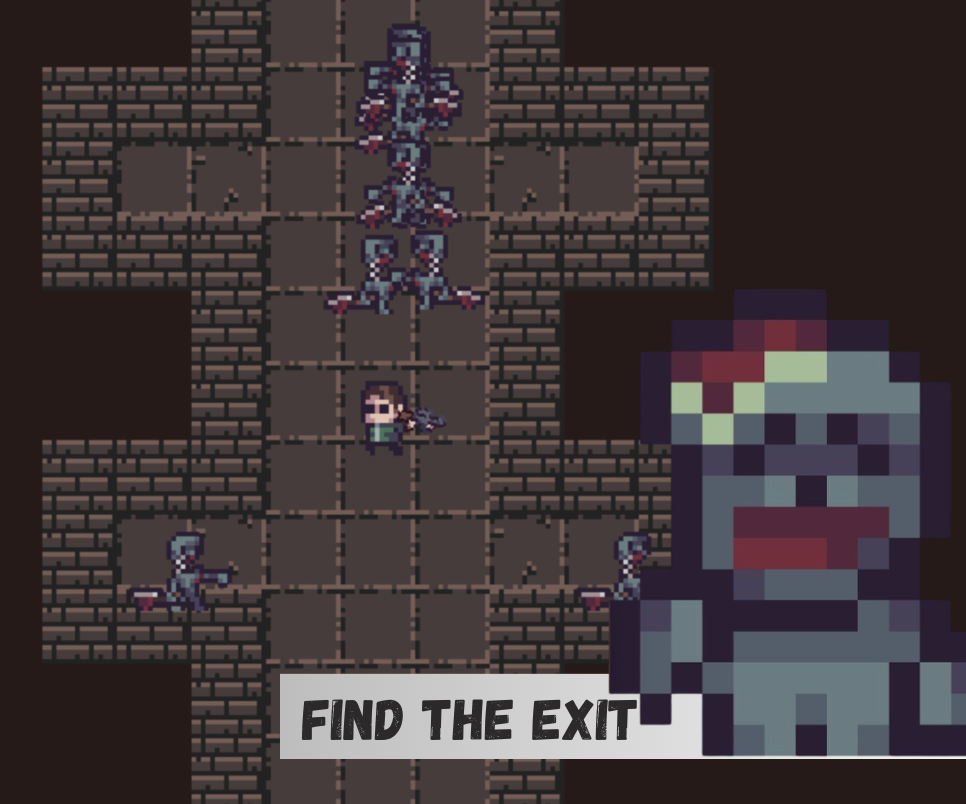
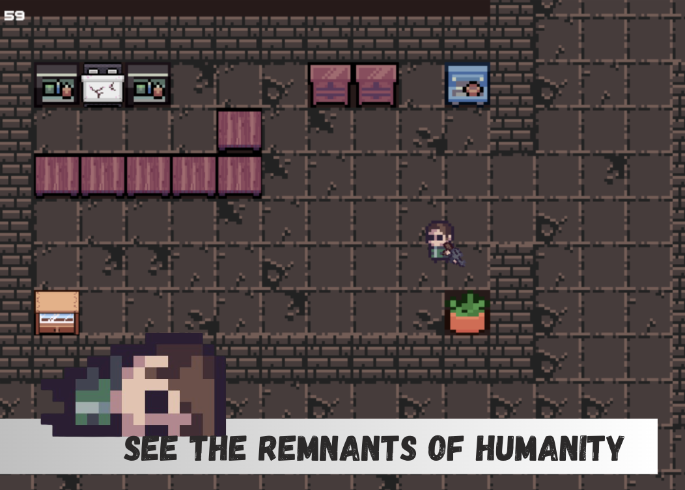

# 🔒 LOCKDOWN — No Way Out

> *A top-down zombie survival shooter set inside a crumbling apartment complex.*



---

## 📖 About the Game

You made the smart call — barricaded yourself inside when the outbreak hit and waited it out.

That was then. The food is gone now. The groaning outside your door is getting louder, and the horde isn't just growing anymore — it's **organizing**. Something deep in the building has changed, and it knows you're trying to leave.

Load up. Scavenge every floor. Shoot your way to the exit before whatever is leading them finds you first.

**LOCKDOWN** is a top-down shooter built in Python with Pygame, where you navigate a zombie-infested apartment complex across multiple levels — scavenging supplies, avoiding or eliminating enemies, and pushing toward an exit that doesn't want to be found.

---

## 🎮 Gameplay

| | |
|---|---|
|  |  |
|  |  |

### Core Loop
- **Explore** dark corridors and tile-mapped floors of a crumbling building
- **Scavenge** for supplies left behind by people who didn't make it
- **Fight or avoid** the infected — every bullet counts
- **Survive** long enough to find a way out — if there is one

### Enemies
- **Zombies** — the standard horde. They walk, they swarm, they don't stop.
- **Mutants** — faster and harder to put down
- **Bob** — something is different about this one
- **Boss** — a fully mutated intelligence. It's been waiting for you.

---

## ⌨️ Controls

| Input | Action |
|-------|--------|
| `W A S D` | Move character |
| `Mouse` | Aim |
| `Left Mouse Button` | Shoot |
| `ESC` | Pause / Menu |

---

## 🗂️ Project Structure

```
WebSystem-GamePortal/
├── index.html          # Game portal landing page
├── README.md           # This file
└── assets/
    └── BG/
        ├── LOCKDOWNBG.png
        ├── EXPLORE.png
        ├── FIGHT.png
        ├── RUN.png
        ├── HOPEISLOST.png
        └── Tracericon.jpg
```

---

## 🛠️ Built With

- **Language:** Python 3
- **Engine / Library:** Pygame-CE
- **Level Design:** CSV-based TileMap system
- **Art:** Custom pixel art sprites + free asset packs (see Credits)

---

## 👥 The Team

| | Name | Role |
|---|---|---|
| 🧑‍💻 | **Tracer Cadapan** | Project Lead · Dev |
| 🧑‍🎨 | **Cris Jay Hubilla** | Assistant Dev · Design |

- 🔗 [github.com/CrisJayHubilla](https://github.com/CrisJayHubilla)

---

## 📅 Development Timeline

| Date | Milestone |
|------|-----------|
| Apr 21 | Project start — Pygame setup, initial game structure |
| Apr 22 | Player sprite animations working via separated sprite sheets |
| Apr 23 | Enemy assets selected, Mob list implemented, weapon rotation working |
| Apr 25 | Shooting mechanic completed, enemies added |
| Apr 27 | TileMap system built, CSV level loading, scrolling camera |
| Apr 28 | Collisions finalized, animations fully working |
| Apr 29 | Enemy AI, level transitions, fade effects, Game Over / Main Menu / Pause screens, sound effects |

---

## 🏆 Credits

- **Main Asset Pack:** [Post-Apocalypse Pixel Art Asset Pack](https://thelazystone.itch.io/post-apocalypse-pixel-art-asset-pack) by TheLazyStone
- **Boss Asset:** [Dungeon Asset Pack](https://pixel-poem.itch.io/dungeon-assetpuck) by Pixel-Poem

---

*Made with rust & grit by Team Pangat · BSIT Game Development · 2nd Year*
